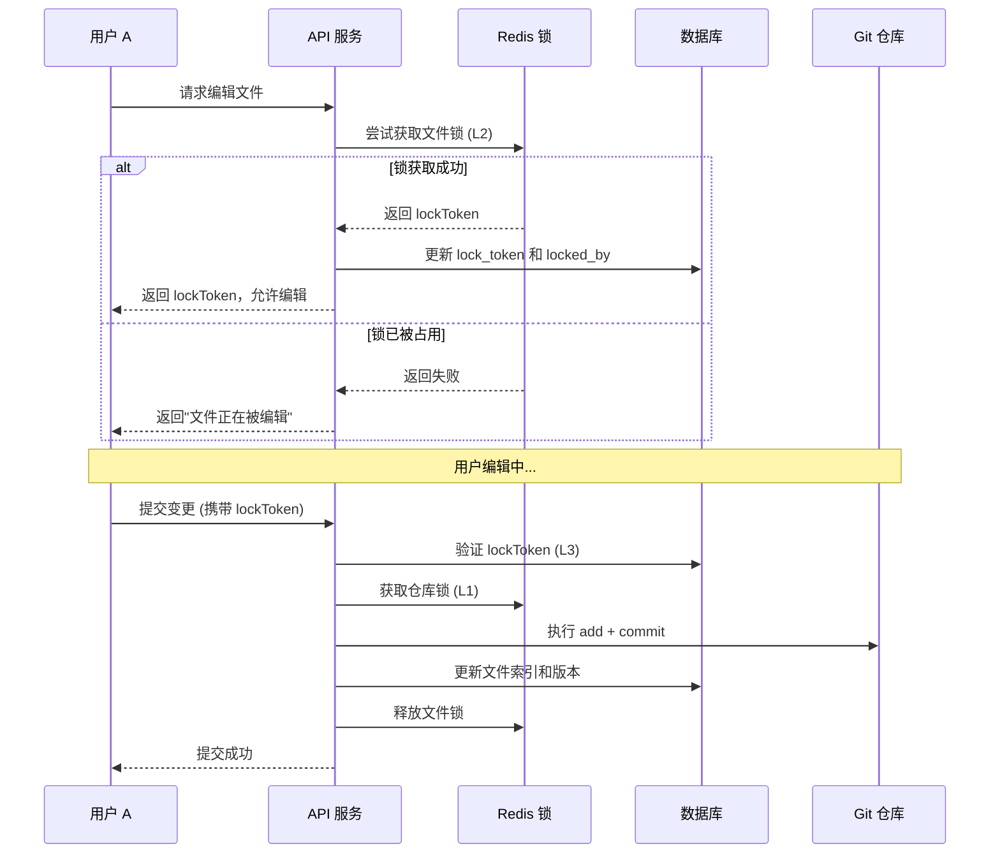
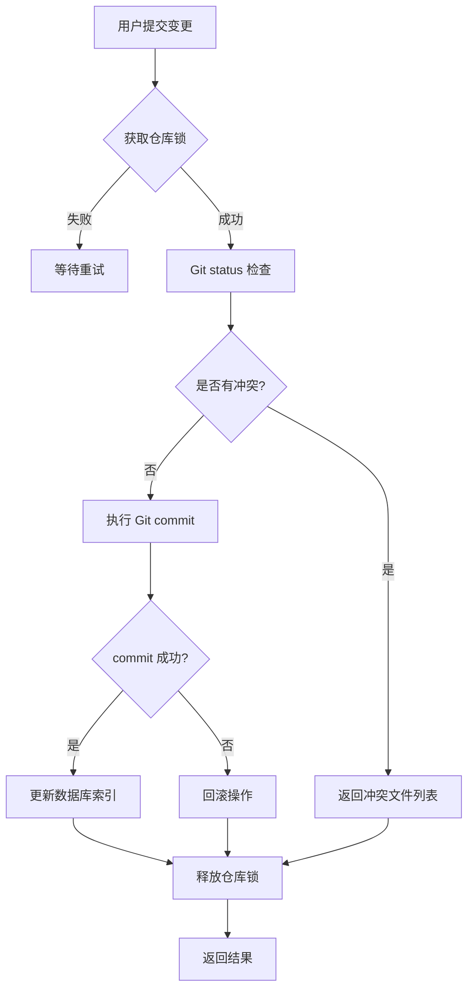

# 多用户微服务文件管理系统 - 需求文档

## 1. 项目概述

### 1.1 项目名称
**Repository Core Service** - 基于 Spring Cloud 的多用户文件管理与代码仓系统

### 1.2 项目背景
构建一个支持多用户并发操作的文件管理系统，用户可维护文件和文件夹，并将变更提交到 Git 代码仓。系统需确保多用户同时操作时不会产生数据冲突，文件存储在 NAS 上，利用 Git 进行版本控制。

### 1.3 核心目标
- ✅ 支持多用户同时在线操作
- ✅ 文件/文件夹的创建、编辑、删除管理
- ✅ 基于 Git 的完整版本控制（commit, branch, diff, history）
- ✅ 多实例部署下的并发冲突解决
- ✅ NAS 网络存储集成
- ✅ 高性能元数据查询（数据库索引）

---

## 2. 系统架构

### 2.1 技术栈
| 组件 | 技术选型 | 说明 |
|------|----------|------|
| **框架** | Spring Boot 3.2.0 + Spring Cloud 2023.0.0 | 微服务基础框架 |
| **ORM** | MyBatis Plus | 数据库操作 |
| **缓存/锁** | Redis + Redisson | 分布式缓存与锁 |
| **Git 引擎** | JGit | Java 实现的 Git 操作 |
| **文件存储** | NAS (NFS/SMB) | 通过网络挂载的文件存储 |
| **数据库** | MySQL 8.0+ | 元数据存储 |
| **API 文档** | SpringDoc OpenAPI | RESTful API 文档 |

### 2.2 架构图
```
┌─────────────────────────────────────────────────────────┐
│                    API Gateway                          │
│                  (鉴权、限流、路由)                      │
└───────────────────────┬─────────────────────────────────┘
                        │
┌───────────────────────▼─────────────────────────────────┐
│              Repository Core Service                    │
│  ┌─────────────┐  ┌─────────────┐  ┌─────────────┐     │
│  │  Git 引擎   │  │  数据库索引  │  │  三级锁机制  │     │
│  │  (JGit)     │  │  (MySQL)    │  │  (Redisson) │     │
│  └──────┬──────┘  └──────┬──────┘  └──────┬──────┘     │
│         │                │                │            │
│         ▼                ▼                ▼            │
│  ┌─────────────┐  ┌─────────────┐  ┌─────────────┐     │
│  │  NAS 存储   │  │  元数据表   │  │  Redis 集群  │     │
│  │  /mnt/nas   │  │  t_* 表     │  │  分布式锁   │     │
│  └─────────────┘  └─────────────┘  └─────────────┘     │
└─────────────────────────────────────────────────────────┘
```

### 2.3 部署模式
- **多实例部署**: 支持水平扩展，通过 Redis 实现分布式锁协调
- **NAS 共享存储**: 所有实例挂载同一 NAS 路径，确保 Git 仓库数据一致性
- **数据库主从**: 支持读写分离，提高查询性能

---

## 3. 功能需求

### 3.1 用户管理模块
| 功能点 | 描述 | 优先级 |
|--------|------|--------|
| 用户注册 | 创建新用户账号 | P0 |
| 用户登录 | 支持用户名/密码登录，返回 JWT Token | P0 |
| 用户信息 | 查看/修改个人信息 | P1 |
| 权限管理 | 基于角色的访问控制 (RBAC) | P1 |

### 3.2 仓库管理模块
| 功能点 | 描述 | 优先级 |
|--------|------|--------|
| 创建仓库 | 初始化 Git 仓库，分配 NAS 路径 | P0 |
| 仓库列表 | 获取用户有权限的仓库列表 | P0 |
| 仓库详情 | 查看仓库基本信息、统计信息 | P1 |
| 删除仓库 | 软删除仓库，保留 Git 历史 | P2 |

### 3.3 文件管理模块
| 功能点 | 描述 | 优先级 |
|--------|------|--------|
| 创建文件/文件夹 | 在指定路径创建文件或目录 | P0 |
| 读取文件 | 获取文件内容（从 Git 读取） | P0 |
| 更新文件 | 修改文件内容，需先获取锁 | P0 |
| 删除文件/文件夹 | 删除指定路径的文件或目录 | P1 |
| 移动/重命名 | 改变文件路径或名称 | P1 |
| 文件树 | 获取目录结构树 | P0 |

### 3.4 锁机制模块（核心）
| 功能点 | 描述 | 优先级 |
|--------|------|--------|
| 申请文件锁 | 用户编辑前申请独占锁 | P0 |
| 释放文件锁 | 提交或取消编辑时释放锁 | P0 |
| 锁超时自动释放 | 防止死锁，超时自动解锁 | P0 |
| 锁状态查询 | 查看文件当前锁定状态 | P1 |
| 强制解锁 | 管理员强制释放他人锁 | P2 |

### 3.5 Git 版本控制模块
| 功能点 | 描述 | 优先级 |
|--------|------|--------|
| 提交变更 | 将工作区变更 commit 到 Git | P0 |
| 查看历史 | 获取文件的 Commit 历史记录 | P0 |
| 差异对比 | 查看两个版本之间的差异 (diff) | P0 |
| 分支管理 | 创建、切换、合并分支 | P1 |
| 版本回滚 | 恢复到指定的历史版本 | P1 |
| 冲突检测 | 提交时自动检测并报告冲突 | P0 |

### 3.6 NAS 存储监控模块
| 功能点 | 描述 | 优先级 |
|--------|------|--------|
| 空间监控 | 实时查看 NAS 剩余空间 | P1 |
| 健康检查 | 定期检查 NAS 连接状态 | P1 |
| 告警通知 | 空间不足或连接异常时告警 | P2 |

---

## 4. 非功能需求

### 4.1 并发控制（三级锁机制）
系统采用**三级锁机制**确保多用户并发安全：

#### L1: 仓库级锁 (Repository Lock)
- **目的**: 防止 Git 索引文件损坏
- **实现**: Redisson `RLock`，粒度为整个仓库
- **场景**: Git commit、push、merge 等原子操作
- **超时**: 30 秒自动释放

#### L2: 文件级锁 (File Lock)
- **目的**: 防止多个用户同时编辑同一文件
- **实现**: Redisson `RLock`，粒度为单个文件路径
- **场景**: 文件编辑、删除、重命名
- **超时**: 15 分钟无操作自动释放

#### L3: 业务锁 Token (Business Token)
- **目的**: 权限验证 + 乐观锁防并发更新
- **实现**: 数据库 `lock_token` 字段 + version 乐观锁
- **场景**: 提交变更时验证锁持有者
- **机制**: 每次锁操作生成新 token，提交时需匹配

### 4.2 性能要求
| 指标 | 要求 | 说明 |
|------|------|------|
| API 响应时间 | < 200ms | 元数据查询类接口 |
| Git 操作时间 | < 2s | commit、diff 等操作 |
| 并发用户数 | ≥ 1000 | 单仓库同时在线用户 |
| 文件数量 | ≥ 100 万 | 单仓库支持的文件数 |

### 4.3 可靠性要求
- **数据一致性**: Git 操作具备原子性，失败自动回滚
- **故障恢复**: Redis 宕机时，数据库锁记录作为兜底
- **备份策略**: Git 仓库每日自动备份到对象存储

### 4.4 安全要求
- **认证**: JWT Token 认证，支持刷新 Token
- **授权**: 基于 RBAC 的细粒度权限控制
- **审计**: 所有关键操作记录审计日志
- **加密**: 敏感数据（密码）BCrypt 加密存储

---

## 5. 数据模型

### 5.1 数据库表结构

#### t_user (用户表)
```sql
CREATE TABLE t_user (
    id BIGINT AUTO_INCREMENT PRIMARY KEY,
    username VARCHAR(50) NOT NULL UNIQUE,
    password_hash VARCHAR(255) NOT NULL,
    email VARCHAR(100),
    full_name VARCHAR(50),
    status TINYINT DEFAULT 1, -- 1-正常，0-禁用
    created_at DATETIME DEFAULT CURRENT_TIMESTAMP,
    updated_at DATETIME DEFAULT CURRENT_TIMESTAMP ON UPDATE CURRENT_TIMESTAMP
);
```

#### t_repository (仓库表)
```sql
CREATE TABLE t_repository (
    id BIGINT AUTO_INCREMENT PRIMARY KEY,
    name VARCHAR(100) NOT NULL,
    description VARCHAR(500),
    owner_id BIGINT NOT NULL,
    nas_path VARCHAR(255) NOT NULL,
    git_url VARCHAR(255),
    version INT DEFAULT 0, -- 乐观锁
    is_deleted TINYINT DEFAULT 0,
    created_at DATETIME DEFAULT CURRENT_TIMESTAMP,
    updated_at DATETIME DEFAULT CURRENT_TIMESTAMP ON UPDATE CURRENT_TIMESTAMP
);
```

#### t_file_index (文件索引表)
```sql
CREATE TABLE t_file_index (
    id BIGINT AUTO_INCREMENT PRIMARY KEY,
    repo_id BIGINT NOT NULL,
    file_path VARCHAR(500) NOT NULL,
    file_type TINYINT NOT NULL, -- 1-文件，2-文件夹
    file_size BIGINT DEFAULT 0,
    last_commit_id VARCHAR(64),
    lock_token VARCHAR(64),
    locked_by BIGINT,
    locked_at DATETIME,
    version INT DEFAULT 0, -- 乐观锁
    is_deleted TINYINT DEFAULT 0,
    created_at DATETIME DEFAULT CURRENT_TIMESTAMP,
    updated_at DATETIME DEFAULT CURRENT_TIMESTAMP ON UPDATE CURRENT_TIMESTAMP,
    UNIQUE KEY uk_repo_path (repo_id, file_path)
);
```

#### t_file_lock (文件锁记录表)
```sql
CREATE TABLE t_file_lock (
    id BIGINT AUTO_INCREMENT PRIMARY KEY,
    repo_id BIGINT NOT NULL,
    file_path VARCHAR(500) NOT NULL,
    user_id BIGINT NOT NULL,
    lock_token VARCHAR(64) NOT NULL UNIQUE,
    expire_time DATETIME NOT NULL,
    created_at DATETIME DEFAULT CURRENT_TIMESTAMP
);
```

#### t_commit_record (提交记录缓存表)
```sql
CREATE TABLE t_commit_record (
    id BIGINT AUTO_INCREMENT PRIMARY KEY,
    repo_id BIGINT NOT NULL,
    commit_hash VARCHAR(64) NOT NULL,
    author_id BIGINT,
    author_name VARCHAR(50),
    message TEXT,
    commit_time DATETIME,
    parent_hash VARCHAR(64),
    created_at DATETIME DEFAULT CURRENT_TIMESTAMP
);
```

#### t_nas_storage_status (NAS 监控表)
```sql
CREATE TABLE t_nas_storage_status (
    id BIGINT AUTO_INCREMENT PRIMARY KEY,
    mount_point VARCHAR(255) NOT NULL UNIQUE,
    total_space BIGINT,
    free_space BIGINT,
    status TINYINT DEFAULT 1, -- 1-正常，0-异常
    last_check_time DATETIME,
    updated_at DATETIME DEFAULT CURRENT_TIMESTAMP ON UPDATE CURRENT_TIMESTAMP
);
```

### 5.2 ER 图
```
┌──────────┐       ┌──────────────┐       ┌─────────────┐
│  t_user  │◄──────│ t_repository │◄──────│ t_file_index│
└──────────┘  1:N  └──────────────┘  1:N  └─────────────┘
    ▲                                       │
    │                                       │ 1:N
    │                                       ▼
    │                                ┌─────────────┐
    │                                │ t_file_lock │
    │                                └─────────────┘
    │                                       ▲
    │                                       │
    │                                ┌─────────────┐
    └────────────────────────────────│t_commit_rec │
                                     └─────────────┘
```

---

## 6. API 设计

### 6.1 认证接口
| 方法 | 路径 | 描述 |
|------|------|------|
| POST | `/api/v1/auth/login` | 用户登录 |
| POST | `/api/v1/auth/register` | 用户注册 |
| POST | `/api/v1/auth/refresh` | 刷新 Token |

### 6.2 仓库接口
| 方法 | 路径 | 描述 |
|------|------|------|
| POST | `/api/v1/repositories` | 创建仓库 |
| GET | `/api/v1/repositories` | 获取仓库列表 |
| GET | `/api/v1/repositories/{id}` | 获取仓库详情 |
| DELETE | `/api/v1/repositories/{id}` | 删除仓库 |

### 6.3 文件接口
| 方法 | 路径 | 描述 |
|------|------|------|
| GET | `/api/v1/repositories/{id}/files` | 获取文件树 |
| POST | `/api/v1/repositories/{id}/files` | 创建文件/文件夹 |
| GET | `/api/v1/repositories/{id}/files/*path` | 读取文件内容 |
| PUT | `/api/v1/repositories/{id}/files/*path` | 更新文件内容 |
| DELETE | `/api/v1/repositories/{id}/files/*path` | 删除文件 |
| POST | `/api/v1/repositories/{id}/files/lock` | 申请文件锁 |
| DELETE | `/api/v1/repositories/{id}/files/lock` | 释放文件锁 |

### 6.4 Git 接口
| 方法 | 路径 | 描述 |
|------|------|------|
| POST | `/api/v1/repositories/{id}/commits` | 提交变更 |
| GET | `/api/v1/repositories/{id}/commits` | 获取提交历史 |
| GET | `/api/v1/repositories/{id}/diff` | 查看差异 |
| POST | `/api/v1/repositories/{id}/branches` | 创建分支 |
| GET | `/api/v1/repositories/{id}/branches` | 获取分支列表 |
| POST | `/api/v1/repositories/{id}/merge` | 合并分支 |

### 6.5 监控接口
| 方法 | 路径 | 描述 |
|------|------|------|
| GET | `/api/v1/nas/status` | 获取 NAS 状态 |
| GET | `/api/v1/health` | 健康检查 |

---

## 7. 业务流程

### 7.1 文件编辑流程


### 7.2 冲突处理流程


---

## 8. 部署方案

### 8.1 环境要求
- **操作系统**: Linux (CentOS 7+ / Ubuntu 20.04+)
- **JDK**: OpenJDK 17+
- **MySQL**: 8.0+
- **Redis**: 6.0+ (推荐集群模式)
- **NAS**: NFS v4 或 SMB 3.0+

### 8.2 配置文件示例
```yaml
# application.yml
spring:
  datasource:
    url: jdbc:mysql://mysql-host:3306/repo_db
    username: repo_user
    password: ${DB_PASSWORD}
  
  redis:
    host: redis-cluster-host
    port: 6379
    password: ${REDIS_PASSWORD}

repository:
  nas:
    base-path: /mnt/nas/git-repositories
    mount-point: //nas-server/shared
  lock:
    timeout: 30s
    retry-times: 3
```

### 8.3 Docker Compose 部署
```yaml
version: '3.8'
services:
  mysql:
    image: mysql:8.0
    environment:
      MYSQL_ROOT_PASSWORD: root123
      MYSQL_DATABASE: repo_db
  
  redis:
    image: redis:7-alpine
    command: redis-server --requirepass redis123
  
  repo-service:
    image: repo-core-service:latest
    ports:
      - "8083:8083"
    volumes:
      - /mnt/nas/git-repositories:/mnt/nas/git-repositories
    depends_on:
      - mysql
      - redis
```

---

## 9. 测试计划

### 9.1 单元测试
- 覆盖所有 Service 层业务逻辑
- Mock Redis 和 Git 操作
- 目标覆盖率：≥ 80%

### 9.2 集成测试
- 测试数据库 + Redis + Git 的交互
- 测试 NAS 文件读写
- 测试分布式锁的有效性

### 9.3 压力测试
- 模拟 1000 并发用户同时操作
- 测试锁竞争场景
- 监控内存、CPU、磁盘 IO

### 9.4 混沌测试
- 模拟 Redis 宕机
- 模拟 NAS 网络中断
- 模拟 MySQL 主从切换

---

## 10. 运维监控

### 10.1 监控指标
- **应用层**: QPS、响应时间、错误率
- **中间件**: Redis 命中率、MySQL 慢查询
- **系统层**: CPU、内存、磁盘使用率
- **业务层**: 活跃锁数量、Git 操作成功率

### 10.2 日志规范
- 所有 API 请求记录访问日志
- 锁操作记录详细审计日志
- Git 操作记录执行日志
- 异常堆栈完整记录

### 10.3 告警规则
- API 错误率 > 5% 持续 5 分钟
- Redis 连接失败
- NAS 剩余空间 < 10%
- 锁超时未释放数量 > 100

---

## 11. 附录

### 11.1 术语表
| 术语 | 说明 |
|------|------|
| JGit | Java 实现的 Git 库 |
| Redisson | Java 的 Redis 客户端，提供分布式锁 |
| NAS | Network Attached Storage，网络附加存储 |
| 乐观锁 | 通过 version 字段控制并发更新 |
| 分布式锁 | 跨 JVM 进程的互斥锁 |

### 11.2 参考文档
- [Spring Cloud 官方文档](https://spring.io/projects/spring-cloud)
- [JGit User Guide](https://wiki.eclipse.org/JGit/User_Guide)
- [Redisson 分布式锁](https://github.com/redisson/redisson/wiki/8.-分布式锁和同步器)
- [MyBatis Plus 文档](https://baomidou.com/)

---

## 12. 版本历史
| 版本 | 日期 | 作者 | 变更说明 |
|------|------|------|----------|
| v1.0 | 2024-01-15 | System | 初始版本，包含核心功能需求 |
| v1.1 | 2024-01-15 | System | 补充用户表和文件锁表，完善三级锁机制 |

---

**文档状态**: ✅ 已完成  
**最后更新**: 2024-01-15  
**GitHub 仓库**: https://github.com/jspluscn/GitDemo1
