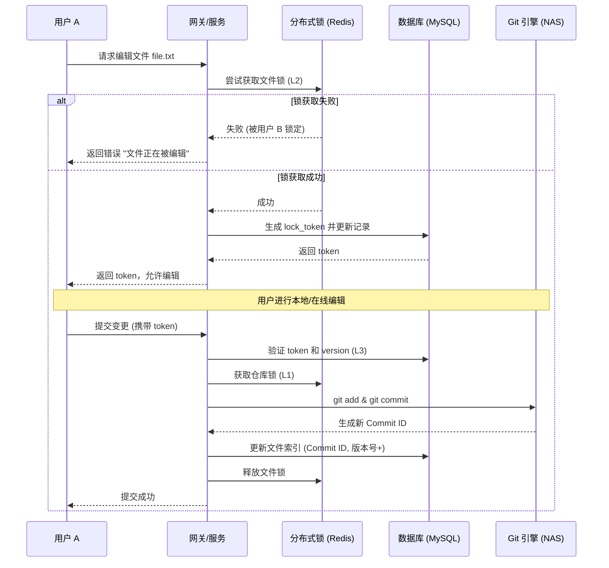

# 用户需求说明书 (User Requirements Specification)

**项目名称**: 基于 Spring Cloud 的多用户文件协作与代码仓管理系统  
**版本**: v1.0  
**日期**: 2024-01-XX  
**状态**: 已确认  

---

## 1. 核心诉求摘要

用户需要一个**基于 Spring Cloud 架构**的分布式微服务系统，核心目标是解决**多用户同时维护文件和文件夹**时的冲突问题，并将变更安全地**提交到 Git 代码仓**。

### 关键约束条件
1. **架构要求**: 必须是 Spring Cloud 微服务架构，支持多实例部署。
2. **存储要求**: 文件实体必须存储在 **NAS (Network Attached Storage)** 上。
3. **并发要求**: 必须支持多用户同时操作，**绝对不能产生数据冲突**。
4. **版本管理**: 必须具备完整的 Git 代码管理功能（提交、分支、历史、回滚）。
5. **实现策略**: 
   - 采用 "Git 原生存储 + 数据库索引 + 三级锁机制" 的单核心服务架构。
   - 不依赖纯数据库版本表，而是利用 Git 作为唯一真理源，数据库仅做元数据索引。

---

## 2. 详细功能需求

### 2.1 多用户协作与冲突控制 (最高优先级)
用户明确要求系统必须处理多用户并发场景，杜绝冲突。
- **需求描述**: 当用户 A 和用户 B 同时尝试编辑同一个文件时，系统必须强制互斥。
- **解决方案**: 实施**三级锁机制**。
  - **L1 仓库级锁**: 防止 Git 索引文件损坏 (Redisson 分布式锁)。
  - **L2 文件级锁**: 防止业务层面的并发写入 (Redisson 分布式锁)。
  - **L3 业务 Token 锁**: 验证操作权限和会话有效性 (数据库 `lock_token` + 乐观锁 version)。
- **验收标准**: 任何并发写操作必须串行化，后到的请求必须收到明确的“文件被锁定”提示，绝不允许覆盖他人未提交的更改。

### 2.2 文件与文件夹管理
- **需求描述**: 支持在线创建、重命名、移动、删除文件和文件夹。
- **特殊要求**: 
  - 文件夹操作需递归处理。
  - 所有操作必须记录操作人和时间。
  - 支持大文件上传（通过 NAS 直传或分片上传）。

### 2.3 Git 代码仓集成
- **需求描述**: 用户的文件修改必须能像程序员一样提交到 Git 仓库。
- **核心功能**:
  - **初始化**: 自动在 NAS 上 `git init` 并关联远程仓库。
  - **提交 (Commit)**: 将暂存区的变更提交，生成 Commit ID，记录作者信息。
  - **历史 (Log)**: 查看文件的完整修改历史、Diff 对比。
  - **分支 (Branch)**: 支持创建分支、切换分支、合并请求（可选）。
- **存储策略**: 文件内容**只**存在于 NAS 上的 `.git` 目录和工作区中，数据库中**不存储**文件二进制内容，仅存储路径、大小、Commit ID 等索引信息。

### 2.4 NAS 存储集成
- **需求描述**: 所有文件数据必须落盘到指定的 NAS 挂载点。
- **配置要求**: 支持动态配置 NAS 挂载路径 (如 `/mnt/nas/git-repositories`)。
- **可靠性**: 系统需具备 NAS 健康检查机制，当 NAS 不可用时阻断写操作并报警。

### 2.5 用户与权限体系
- **需求描述**: 系统需支持多用户注册、登录和鉴权。
- **数据模型**: 必须包含 `t_user` 表，记录用户基本信息及密码哈希。
- **权限控制**: 
  - 只有文件锁定者才能提交该文件的变更。
  - 仓库所有者拥有最高权限。

---

## 3. 技术架构约束

### 3.1 微服务架构
- **框架**: Spring Boot 3.2+ / Spring Cloud 2023+
- **注册中心**: Nacos 或 Eureka (支持多实例发现)
- **网关**: Spring Cloud Gateway (统一鉴权、限流)
- **核心服务**: `repository-core-service` (单体核心，包含 Git/DB/Lock 逻辑)

### 3.2 数据存储设计
用户明确询问并确认了以下设计模式：
- **Git 原生存储**: 文件内容、版本历史、Diff 数据全部由 Git 管理。
- **数据库索引**: MySQL 仅存储 `t_repository`, `t_file_index`, `t_user`, `t_file_lock` 等元数据表，用于快速查询文件列表和权限校验。
- **缓存与锁**: Redis + Redisson 实现高性能分布式锁。

### 3.3 部署环境
- **操作系统**: Linux (需支持 NFS/SMB 挂载)
- **容器化**: 支持 Docker/K8s 部署
- **外部依赖**: MySQL 8.0+, Redis 6.0+, NAS 存储

---

## 4. 业务流程图解 (用户视角)

### 4.1 文件编辑与提交流程

---

## 5. 交付物清单

根据用户诉求，最终交付物包含：
1. **源代码**: 
   - `repository-core-service`: 核心微服务代码。
   - 包含 JGit 封装、Redisson 锁逻辑、NAS 适配层。
2. **数据库脚本**: 
   - `schema.sql`: 包含 `t_user`, `t_repository`, `t_file_index`, `t_file_lock` 等 6 张表。
3. **配置文件**: 
   - `application.yml`: 含 NAS 路径、Redis、MySQL 配置模板。
4. **文档**: 
   - `REQUIREMENTS.md`: 详细需求文档。
   - `API.md`: 接口定义文档。
5. **部署脚本**: 
   - `docker-compose.yml`: 编排 MySQL, Redis, App 服务。

---

## 6. 验收标准 (Acceptance Criteria)

1. **并发测试**: 使用 JMeter 模拟 50+ 用户同时操作同一文件，**零数据丢失，零冲突覆盖**。
2. **Git 完整性**: 在 NAS 上直接执行 `git log` 能看到所有通过系统提交的记录，且内容一致。
3. **断网恢复**: NAS 短暂断开后恢复，系统能自动重连且不损坏 Git 索引。
4. **权限验证**: 未持有锁的用户无法提交文件，系统明确拒绝。
5. **多实例**: 启动 2 个服务实例，请求负载均衡后，锁机制依然全局有效。

---

## 7. 变更记录

| 日期 | 版本 | 变更内容 | 确认人 |
| :--- | :--- | :--- | :--- |
| 2024-01-XX | v1.0 | 初始需求确认：明确 Spring Cloud + NAS + 三级锁 + Git 原生存储架构 | 用户 |
| 2024-01-XX | v1.1 | 补充 `t_user` 和 `t_file_lock` 表结构，完善用户体系 | 用户 |
| 2024-01-XX | v1.2 | 确认推送至 GitHub (`jspluscn/GitDemo1`) | 用户 |

---

> **备注**: 本系统核心设计理念为 **"Git is the Source of Truth"** (Git 是唯一真理源)，数据库仅作为加速查询和权限控制的辅助层，确保版本管理的原子性和可靠性。
